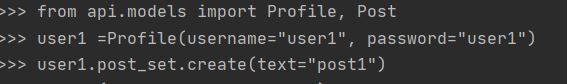
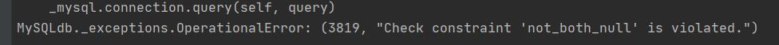
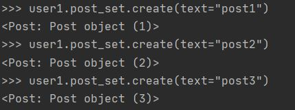
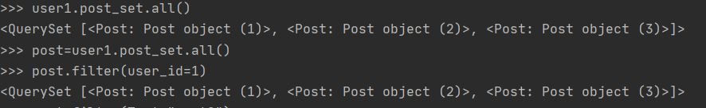
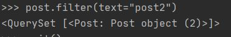

# CEOS 13기 백엔드 스터디
## REST API 서버 개발
### 인스타그램 클론

## 2주차 과제
### 모델 설명


####User (Profile)
id를 pk로 설정.  
 (username을 UUID로 해서 pk로 할 때 장점도 많은데 mysql에서 특히 부담이 크다고 합니다. 어떤 때에 좋을까요??)

인스타그램 가입 시 phone 혹은 email로 가입 조건. 즉 둘다 null이면 가입이 되어선 안됨.  
프론트에서 구현 가능한 조건일 것 같지만 database에서도 check constraints 를 통해 조건을 주어줄 수 있길래 구현해보았습니다.
```
    class Meta:
        constraints = [
            models.CheckConstraint(
                check=(models.Q(phone__isnull=False) | models.Q(email__isnull=False)),
                name='not_both_null'
            )
        ]
```
Constraints는 다음과 같이 작동합니다

- 잘못된 형식의 profile (phone, email 둘다 null)

-save() 되지 않음


####Follow
User 와 one to many 관계. 팔로우관계를 일방적인 형태로 저장.

####Post
User 와 one to many 관계. 한 유저가 여러개의 포스팅, 하나의 포스트는 하나의 유저를 가짐. 
생성 날짜는 자동 생성되도록 설정.

####Photo, Video
한 포스트에 여러개의 이미지나 여러개의 비디오가 올라갈 수 있었던 점에서 포스트와 one to many관계로 각각 설정하였습니다.  
이 때 이미지 업로드 설정을 위해서 pillow를 다운받아줘야하며 settings.py와 urls.py 에서 media 경로 설정이 필요합니다.

####Tag, Location
태그는 Post당 여러명의 유저를 태그할 때 사용할 테이블입니다. Post, User와 일대다 관계를 맺습니다.
이미지나 비디오의 장소또한 포스트에 태그가 가능한데, 장소는 하나밖에 안된다고 해서 일대일 관계를 맺어줬습니다.

####Comment
포스트마다 달리는 댓글 테이블입니다. User와 Post와 일대다 관계를 맺습니다.  
parent_id는 댓글의 hierarchy 구성을 위해 넣어줬는데 포스트에 바로 달린 댓글은 parent_id가 0,
대댓글은 1, 대대댓글은 2 등의 구성을 가집니다.

####Like
좋아요 기능은 포스트, 코멘트 둘다에 있습니다. 좋아요 한 사람도 표시되므로 User도 fk로 받고 Post, Comment도 fk로 받습니다.  
*** 수정 ! post와 comment는 nullable 한 컬럼입니다.


### ORM 적용해보기
1. Post 모델에 객체 3개 넣어보기


2. 쿼리셋 조회


3. filter 함수 


### 간단한 회고
Abstract Base User 를 활용하여 유저모델을 확장하고 oneToOneField로 Profile과
1대 1관계를 맺는 것으로 수정하였습니다.   
유저모델과 추후 authentication까지 좀 더 깊이 공부해보아야 할 것 같습니다. 뭔가 공부할수록 모르는게 더 늘어나는 느낌!ಥ_ಥ
