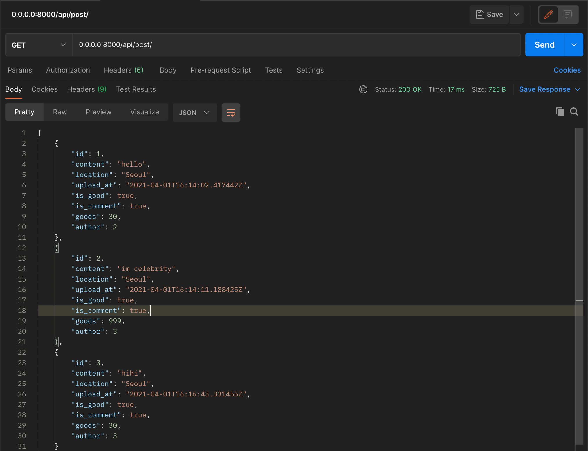
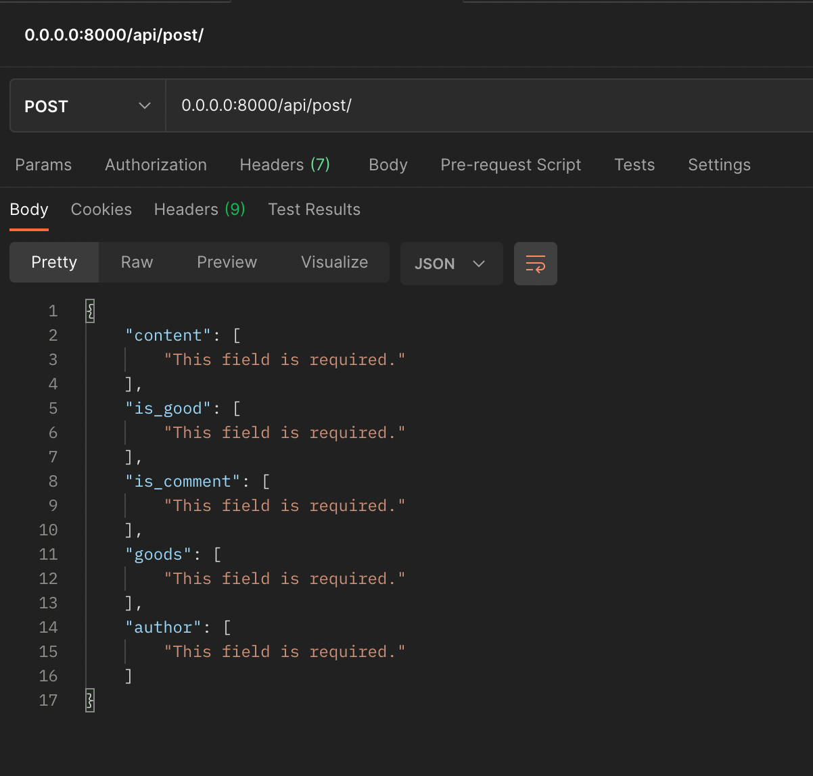
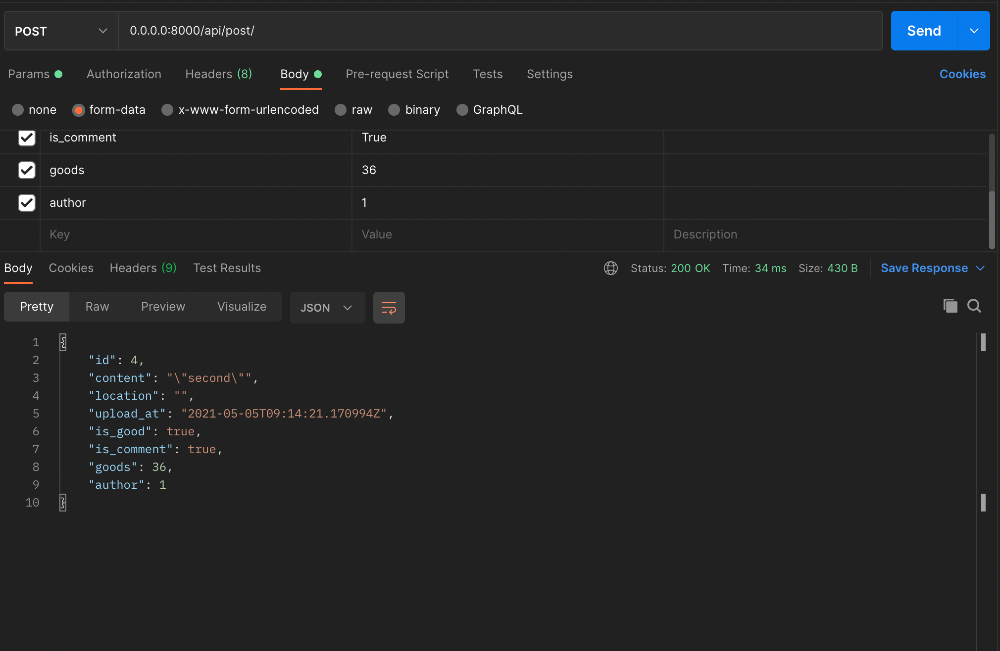
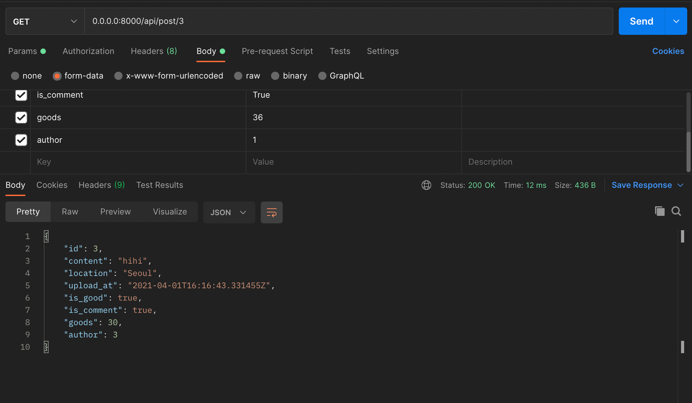
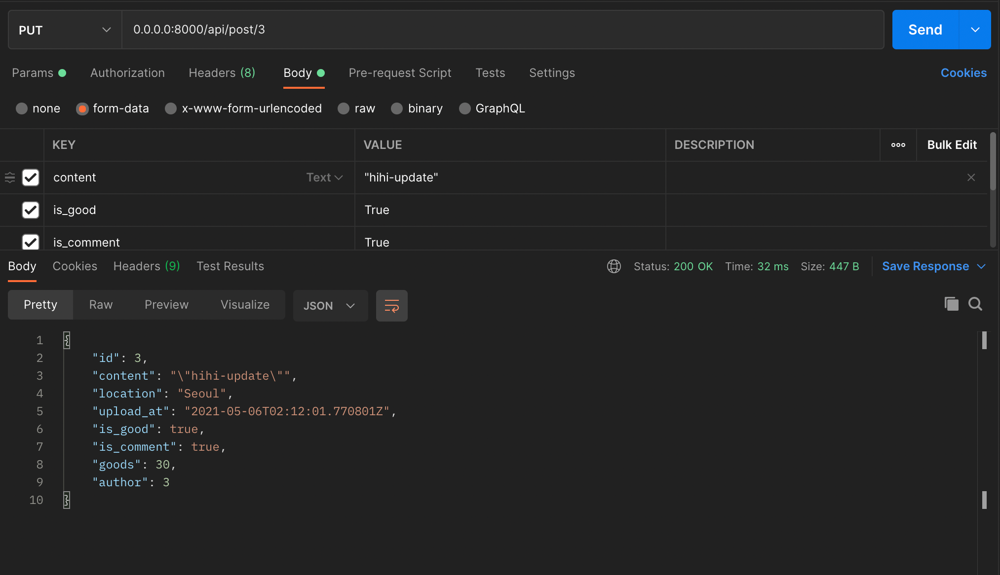
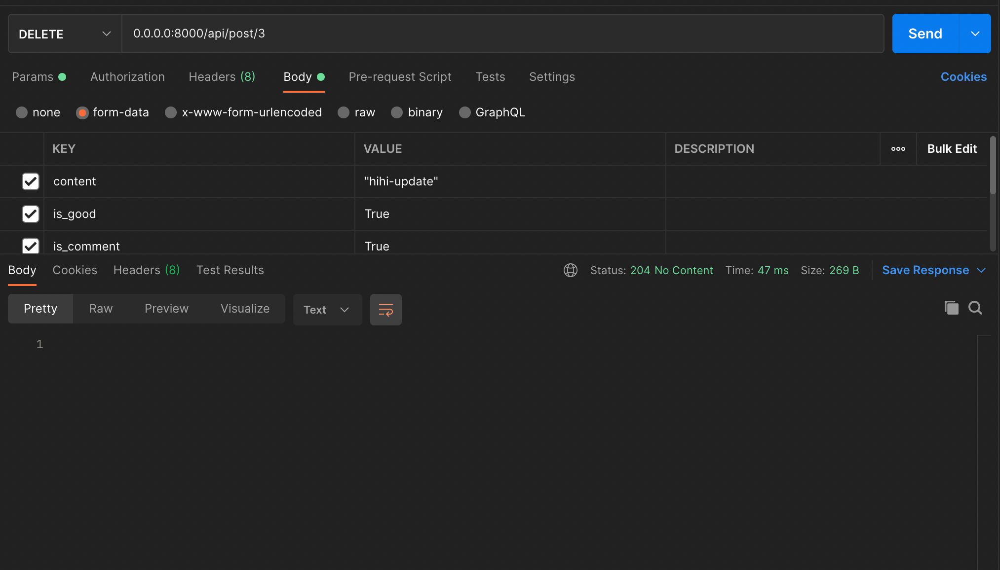

## CEOS 13기 백엔드 스터디

### REST API 서버 개발

#### 인스타그램 클론

#### **모델 설명**

인스타그램에 대해 본인이 작성한 모델들에 대한 설명과 모델 간의 관계 등을 적어주세요!  


**작성한 모델**

1\. User : 장고에서 지원하는 AbstractBaseUser를 상속받고 있는 모든 유저를 담은 모델

```
class User(AbstractBaseUser):
	username= models.CharField(max_length=255)
	USERNAME_FIELD = 'username'
	insta_id = models.CharField(max_length=255, unique=True, )
	is_professional = models.BooleanField(default=False)
```

-   username : 사용자의 이름을 담고 있다.
    -   AbstractBaseUser를 상속할때 필수로 들어가야 하는 정보
-   insta\_id : 인스타 아이디
    -   인스타 아이디는 겹칠 수 없으므로 unique = True로 설정한다. 
-   is\_professional : 공식계정인지를 확인하는 필드
    -   대부분 아니므로 default : False 를 설정한다. )

```
AbstractUser : 
장고에서 미리 제공하는 유저 모델. 상속해서 사용할 수 있다
id / password / last_login / is_superuser /
username / first_name / last_name / email / is_staff / is_active / date_joined

AbstractBaseUser : 
AbstractBaseUser의 간단한 버전,
id / password / last_login
```


2\. Profile : 유저의 세부 정보를 담는 모델. User모델과 1:1 로 관계를 맺고 있다. 

\# CASCADE : ForeignKeyField가 바라보는 값이 삭제될 때 ForeignKeyField를 포함하는 모델 인스턴스(row)도 삭제된다.

```
class Profile(models.Model):
	owner = models.OneToOneField(User, on_delete=models.CASCADE)
	profile_pic = models.TextField()
	profile_name = models.TextField()
	profile_website = models.TextField()
	profile_info = models.TextField()
```

-   owner : 작성자를 포린키로 들고온다.
    -   유저는 하나의 프로필만 가질 수 있으므로 OneToOneField 로 설정하고 on\_delete = CASCADE 설정을 건다. 
-   profile\_pic : 인스타 사진
-   profile\_name : 인스타에 표시한 이름
-   profile\_websitee : 인스타에 올리는 웹사이트
-   profile\_info : 인스타 프로필 소개

3\. Post : 작성한 게시글을 담은 모델

```
class Post(models.Model):
  author = models.ForeignKey(User, on_delete=models.CASCADE)
  content = models.TextField()
  location = models.TextField()
  upload_at = models.DateTimeField(auto_now=True)
  is_good = models.BooleanField()
  is_comment = models.BooleanField()
  goods = models.PositiveIntegerField()

  def publish(self):
    self.upload_at = timezone.now()
    self.save()

  def __str__(self):
    return self.content
```

-   author : 작성자를 포린키로 들고온다.
    -   작성자가 사라지면 글이 삭제되도록 on\_delete = CASCADE 설정을 건다. 
-   content : 작성한 게시글
-   location : 게시글 올린 장소
-   upload\_at : 게시글 올린 시간
    -   default를 현재시간으로 설정한다.

-   is\_good : 좋아요 막을건지 아닌지
-   is\_comment : 댓글 막을건지 아닌지
-   goods : 좋아요 개수

4\. Images : 게시글에 들어가는 사진을 담는 모델

```
class Images(models.Model):
  post = models.ForeignKey(Post, blank=False, null=False, on_delete=models.CASCADE)
  content = models.TextField()
```

-   post : 해당하는 게시글
-   content : 이미지 url주소
-   index : 이미지 순서

5\. PostComment : 게시글에 작성된 댓글을 담은 모델

```
class PostComment(models.Model):
  post = models.ForeignKey(Post, on_delete=models.CASCADE)
  author = models.ForeignKey(User , on_delete=models.CASCADE)
  content = models.TextField()
  upload_at = models.DateTimeField(auto_now=True)
```

-   post : 해당하는 게시글
-   author : 댓글 작성한 사람
-   content : 댓글 내용
-   upload\_at : 올린 시간
-   goods : 댓글 좋아요 개

6\. PostCommentReply : 게시글에 작성된 댓글의 대댓글을 담은 모델

```
class PostCommentReply(models.Model):
  postcomment = models.ForeignKey(PostComment, on_delete=models.CASCADE)
  author = models.ForeignKey('auth.User', on_delete=models.CASCADE)
  content = models.TextField()
  upload_at = models.DateTimeField(auto_now=True)


```

-   postcomment : 해당하는 댓글
-   author : 댓글 작성한 사람
-   content : 댓글 내용
-   upload\_at : 올린 시간

7\. StoryPost : 인스타그램 스토리를 담은 모델 

```
class StoryPost(models.Model):
  author = models.ForeignKey(User, on_delete=models.CASCADE)
  pic = models.TextField()
  upload_at = models.DateTimeField(auto_now=True)

  def publish(self):
    self.upload_at = timezone.now()
    self.save()

  def __str__(self):
    return self.content
```

-   author : 스토리 올린 사람
-   pic : 스토리에 올라간 사진
-   upload\_at : 스토리 올라간 시간

**Migration 하기**

```
python manage.py makemigrations
  Migrations for 'api':
  api/migrations/0002_auto_20210324_0648.py
  - Alter field author on post

python manage.py migrate
  Operations to perform:
  Apply all migrations: admin, api, auth, contenttypes, sessions
  Running migrations:
  Applying api.0002_auto_20210324_0648... OK
```


#### **ORM 적용해보기**

```
# 쉘 실행하기
python manage.py shell

# 새로운 객체 저장하기
from api.models import User
from api.models import Post

user1 = User(insta_id="cutiekuku",is_professional = False)
post1 = Post(author = user1, content="hihi",location="Seoul",is_good=True,is_comment=True,goods=30)
user1.save()
post1.save()

# 쿼리 조회하기
Post.objects.all()
<QuerySet [<Post: hihi>, <Post: 두번째 글>, <Post: kuku is so cute>]>
Post.objects.filter(goods = 30)
<QuerySet [<Post: hihi>]>
```


#### **간단한 회고**

1. NoSQL 과의 차이

foreign key를 제공하지 않는 NoSQL은 대부분의 쿼리를 고유 ID와 이를 담은 배열로 이루어지는 경우가 많다.

예를 들어 "한 게시글에 여러 사진이 들어있을 경우" : 

-   NoSQL 

<table style="color : #FFF; border-collapse: collapse; width: auto; height: auto;" border="1"><tbody><tr style="height: 20px;"><td style="width: 20.8139%; height: 20px;">&nbsp;</td><td style="width: 79.1861%; height: 20px;"><span style="font-family: 'Noto Sans Light';">게시글</span></td></tr><tr style="height: 20px;"><td style="width: 20.8139%; height: 20px;"><span style="font-family: 'Noto Sans Light';">id</span></td><td style="width: 79.1861%; height: 20px;"><span style="font-family: 'Noto Sans Light';">id-kwejsifjlekfslkfd</span></td></tr><tr style="height: 19px;"><td style="width: 20.8139%; height: 19px;"><span style="font-family: 'Noto Sans Light';">pics</span></td><td style="width: 79.1861%; height: 19px;"><span style="font-family: 'Noto Sans Light';">["id-sdfef","id-welkfjs", ... , "id-skdjf"]</span></td></tr></tbody></table>

↓ 위에서 아래를 찾는다.

<table style="color : #FFF;border-collapse: collapse; width: auto; height: auto;" border="1"><tbody><tr style="height: 20px;"><td style="width: 21.3953%; height: 20px;">&nbsp;</td><td style="width: 78.6047%; height: 20px;"><span style="font-family: 'Noto Sans Light';">pics</span></td></tr><tr style="height: 20px;"><td style="width: 21.3953%; height: 20px;"><span style="font-family: 'Noto Sans Light';">id</span></td><td style="width: 78.6047%; height: 20px;"><span style="color: #FFF; font-family: 'Noto Sans Light';">id-sdfef</span></td></tr></tbody></table>

-   mySQL

<table style="color : #FFF;border-collapse: collapse; width: auto; height: auto;" border="1"><tbody><tr><td style="width: 49.6063%;">&nbsp;</td><td style="width: 50%;"><span style="font-family: 'Noto Sans Light';">post</span></td></tr><tr><td style="width: 49.6063%;"><span style="font-family: 'Noto Sans Light';">id</span></td><td style="width: 50%;"><span style="font-family: 'Noto Sans Light';">id-kwejsifjlekfslkfd</span></td></tr></tbody></table>

↑ 아래에서 위를 참조한다.

<table style="color : #FFF;border-collapse: collapse; width: auto; height: auto;" border="1"><tbody><tr><td style="width: 49.8837%;">&nbsp;</td><td style="width: 50%;"><span style="font-family: 'Noto Sans Light';">pics</span></td></tr><tr><td style="width: 49.8837%;"><span style="font-family: 'Noto Sans Light';">post - id</span></td><td style="width: 50%;"><span style="color: #FFF; font-family: 'Noto Sans Light';">id-<span style="color: #FFF;">kwejsifjlekfslkfd</span></span></td></tr></tbody></table>

이런 이유로 관계형 DB는 Array 가 딱히 필요없다는 것을 알게되었다. 

2. 장고의 장고 앱 설치

Node JS를 할때, 매번 필요한 모듈을 설치해야 해서 화가 날때,

장고는 모든 모듈이 들어있어서 쉽게 사용할 수 있다는 이야기를 들은 적이 있다.

그러나 이번에 작업을 하며, 끊임없이 pip install을 하여 장고 앱을 설치하였는데, 노드 모듈 설치하는 것과 비슷하다고 느꼈다. 

어서 장고를 익혀 장고가 어느 부분에서 더 편한건지를 깨닫고 싶다.

---
#Week 4 DRF2: API View


## 1\. Postman 

### 1.1 Postman 이란
```
A powerful GUI platform to make your API development faster & easier, 
from building API requests through testing, documentation and sharing.
```
즉, API request를 만들어서 Api를 테스트 해볼 수 있는 프로그램이다.

포스트 맨을 사용하기 위해선 노트북에 설치 해주는 게 간단한데, (굳이 설치 안하고 웹페이지에서도 할 수는 있다. )

설치는 다음 링크에서 하면 된다. 

[www.postman.com/downloads/]

### 1.2 Postman 사용하기 with Django

####1.2.1  Postman 세팅하기

처음 포스트맨을 설치한 후, Sign in을 하면 다음과 같이 뜨는데, 여기서 Create New 버튼을 눌러 새로운 request를 만들어 준다. 

이후 create a request를 정상적으로 하였다면, 다음과 같은 화면을 볼 수 있다. 
우선 1번 칸에는 method를 정의하고 URL를 넣을 수 있다. 
여기서 method란 get, post, delete등을 말하며, URL은 보낼 위치의 주소를 말한다.
로컬로 개발을 하였다면, 내가 설정한 주소를 넣으면 되고, 외부 주소로 보내고 싶다면 관리자 도구로 주소를 확인할 수 있다.

2) 

쿼리를 쏘는 곳이다.

즉 여기에 x = 10, y= 20 이라는 정보를 담아 보내면, ?x=10&&y=20 이런식으로 주소 옆에 붙어서 데이터가 날라간다. 
다시 말하면 공개되어 데이터를 보내므로 보안에 취약할 수 있다. 
특정 데이터를 가지고오는 get method에 적합하다. 

3) 

Body로 정보를 담아 보내는 곳이다. 
2)에서와 같이 여기에 x= 10, y= 20이라는 정보를 담아 보내면 숨겨져서 보내지게 되므로 쿼리보다 조금 안정성이 보장된 api 전송 방식이다. 
post method에서 주로 사용하다. 

####1.2.2  Django에서 api 세팅하기

우선 포스트맨에서 로컬로 주소를 쏘기 위해 포트 번호를 설정해주어야 한다. 
다음과 같은 명령어를 통해 로컬 서버를 켜주자.

```
python manage.py runserver 0.0.0.0:8000
```

여기서 난 다음과 같은 오류가 떴는데

```
Invalid HTTP_HOST header: '0.0.0.0:3000'. You may need to add '0.0.0.0' to ALLOWED_HOSTS.
```

setting.py 에 들어가 ALLOWED\_HOSTS = \["0.0.0.0"\]을 추가하니 간단히 해결되었다.

무튼 이렇게 서버를 켜준 뒤, postman으로 돌아가서 URL 부분에
0.0.0.0:8000/내가 설정한 url 
이렇게 넣어둔 뒤 send 등을 해주면 된다. 

####1.2.3  Django에서 api request 메소드 작성하기

#### **views.py**

views.py는 URL에서 불러지는 함수가 정확히 어떤 행동을 해야하는지를 모아둔 파일이라고 생각하면 된다. 
tistory로 예를 들자면, 내가 gimkuku0708.tistory.com/20 이라는 url로 method GET을 보냈으면,
20번째 게시글이 들어와야 한다. 

이때, views.py 에서는 def get 일때 pk가 20번째 인 게시글을 찾고, 이를 return 해주는 함수가 적혀있다.   


나는 장고의 클래스 기반 뷰(CBV)를 사용하여 함수를 정의하였다. 
CBV는 django.views.View를 상속받아서 생성하며, request 명과 클래스 내 method 명이 같다는 특징이 있다. 
예를 들어 내가 포스트 맨을 통해 post request를 보내면 Class 내의 post method가 실행되는 것이다. 

내가 작성한 예시를 보자.


```
class PostDetail(APIView):

    # 특정 포스트를 들고오는 API
    def get(self, request, pk):
        post = self.get_object(pk=pk)
        serializer = PostSerializer(post)
        return Response(serializer.data)

    # 특정 포스트를 삭제하는 api
    def delete(self, request, pk):
        post = self.get_object(pk=pk)
        post.delete()
        return Response(status=status.HTTP_204_NO_CONTENT)
```

다음과 같이 적었을 때, 이는 PostDetail이라는 클래스를 사용한 url이 method get을 하면,
특정 PK를 찾은 후, 그 data를 serializer 하여 return을 해준다는 것을 알 수 있다. 

여기서 PostSerializer란, 간단하게 파이썬 data를 JSON으로 보내는 과정이라고 할 수 있는데, serializers.py 에 정의되어 있다. 

#### **serializers.py**

```
class PostSerializer(serializers.ModelSerializer):
    class Meta:
        model = Post
        fields = '__all__'
```

위 코드의 뜻은, Post라는 모델에 담긴 모든 필드를 리턴한다는 뜻이다. 

Serializer는 다음과 같이 특정 필드만 리턴할 수도 있다. 

```
class PostSerializer(serializers.ModelSerializer):
    class Meta:
        model = Post
        fields = ('content', 'author')
```

#### **urls.py**

위의 models와 serializers 들을 잘 적었다면, 이들을 URL 주소로 바꾸어주어야 한다.
그 정보를 담은 곳이 바로 urls.py이다. 

다음과 같이 

path ('url 주소', views.내가정의한클래스.as\_view()) 를 이용하여 내가 작성한 클래스(메소드)와 URL주소를 연결시켜줄 수 있다.
나는 특정 data를 접근해야하는 함수의 모음 (PostDetail)과 접근하지 않아도 되는 함수(PostList)
두개의 클래스로 나누어 path를 작성하였다. 

```
from django.urls import path
from api import views

urlpatterns = [
    path('post/', views.PostList.as_view()),
    path('post/<int:pk>', views.PostDetail.as_view())
    ]
```


#####1.2.3 Postman에서 api 쏘기

url 설정까지 마쳤으면, 이제 Postman에서 api가 잘 날라오는지 확인해보면 된다!!

**//URL에서 포스트는 포스팅할 때의 post 이다! 쏜다할때 post 아님 **

URL : api/post/3method : GET
내가 작성한 data들이 잘 넘어오는 모습을 볼 수 있다.
이는 urls.py의 위 함수를 통해 views.py의 PostDetail로 넘어갔으며, PostDetail의 get method가 실행된 것이다. 

```
  path('post/<int:pk>', views.PostDetail.as_view())
```

```
class PostDetail(APIView):
    def get(self, request, pk):
        post = self.get_object(pk=pk)
        serializer = PostSerializer(post)
        return Response(serializer.data)
```

같은 방법으로 put delete를 실행해봤을 때, 모두 잘 수행됨을 알 수 있다.

---


api/post

method : GET





api/post

method : POST




아무 content도 넣지 않자 field가 필요하다고 나온다. 




body로 내용을 채워 보내자 정상적으로 보내지는 모습. 

api/post/3

method : GET



특정 번호를 넣어서 보내자 그 api가 날라온다. 


api/post/3

method : PUT




api/post/3

method : DELETE

