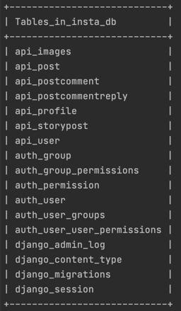
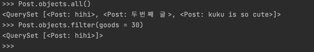

## CEOS 13기 백엔드 스터디

### REST API 서버 개발

#### 인스타그램 클론

#### **모델 설명**

!\[img.png\](img.png)  
인스타그램에 대해 본인이 작성한 모델들에 대한 설명과 모델 간의 관계 등을 적어주세요!  


**작성한 모델**

1\. User : 장고에서 지원하는 AbstractBaseUser를 상속받고 있는 모든 유저를 담은 모델

```
class User(AbstractBaseUser):
	username= models.CharField(max_length=255)
	USERNAME_FIELD = 'username'
	insta_id = models.CharField(max_length=255, unique=True, )
	is_professional = models.BooleanField(default=False)
```

-   username : 사용자의 이름을 담고 있다.
    -   AbstractBaseUser를 상속할때 필수로 들어가야 하는 정보
-   insta\_id : 인스타 아이디
    -   인스타 아이디는 겹칠 수 없으므로 unique = True로 설정한다. 
-   is\_professional : 공식계정인지를 확인하는 필드
    -   대부분 아니므로 default : False 를 설정한다. )

```
AbstractUser : 
장고에서 미리 제공하는 유저 모델. 상속해서 사용할 수 있다
id / password / last_login / is_superuser /
username / first_name / last_name / email / is_staff / is_active / date_joined

AbstractBaseUser : 
AbstractBaseUser의 간단한 버전,
id / password / last_login
```


2\. Profile : 유저의 세부 정보를 담는 모델. User모델과 1:1 로 관계를 맺고 있다. 

\# CASCADE : ForeignKeyField가 바라보는 값이 삭제될 때 ForeignKeyField를 포함하는 모델 인스턴스(row)도 삭제된다.

```
class Profile(models.Model):
	owner = models.OneToOneField(User, on_delete=models.CASCADE)
	profile_pic = models.TextField()
	profile_name = models.TextField()
	profile_website = models.TextField()
	profile_info = models.TextField()
```

-   owner : 작성자를 포린키로 들고온다.
    -   유저는 하나의 프로필만 가질 수 있으므로 OneToOneField 로 설정하고 on\_delete = CASCADE 설정을 건다. 
-   profile\_pic : 인스타 사진
-   profile\_name : 인스타에 표시한 이름
-   profile\_websitee : 인스타에 올리는 웹사이트
-   profile\_info : 인스타 프로필 소개

3\. Post : 작성한 게시글을 담은 모델

```
class Post(models.Model):
  author = models.ForeignKey(User, on_delete=models.CASCADE)
  content = models.TextField()
  location = models.TextField()
  upload_at = models.DateTimeField(auto_now=True)
  is_good = models.BooleanField()
  is_comment = models.BooleanField()
  goods = models.PositiveIntegerField()

  def publish(self):
    self.upload_at = timezone.now()
    self.save()

  def __str__(self):
    return self.content
```

-   author : 작성자를 포린키로 들고온다.
    -   작성자가 사라지면 글이 삭제되도록 on\_delete = CASCADE 설정을 건다. 
-   content : 작성한 게시글
-   location : 게시글 올린 장소
-   upload\_at : 게시글 올린 시간
    -   default를 현재시간으로 설정한다.

-   is\_good : 좋아요 막을건지 아닌지
-   is\_comment : 댓글 막을건지 아닌지
-   goods : 좋아요 개수

4\. Images : 게시글에 들어가는 사진을 담는 모델

```
class Images(models.Model):
  post = models.ForeignKey(Post, blank=False, null=False, on_delete=models.CASCADE)
  content = models.TextField()
```

-   post : 해당하는 게시글
-   content : 이미지 url주소
-   index : 이미지 순서

5\. PostComment : 게시글에 작성된 댓글을 담은 모델

```
class PostComment(models.Model):
  post = models.ForeignKey(Post, on_delete=models.CASCADE)
  author = models.ForeignKey(User , on_delete=models.CASCADE)
  content = models.TextField()
  upload_at = models.DateTimeField(auto_now=True)
```

-   post : 해당하는 게시글
-   author : 댓글 작성한 사람
-   content : 댓글 내용
-   upload\_at : 올린 시간
-   goods : 댓글 좋아요 개

6\. PostCommentReply : 게시글에 작성된 댓글의 대댓글을 담은 모델

```
class PostCommentReply(models.Model):
  postcomment = models.ForeignKey(PostComment, on_delete=models.CASCADE)
  author = models.ForeignKey('auth.User', on_delete=models.CASCADE)
  content = models.TextField()
  upload_at = models.DateTimeField(auto_now=True)


```

-   postcomment : 해당하는 댓글
-   author : 댓글 작성한 사람
-   content : 댓글 내용
-   upload\_at : 올린 시간

7\. StoryPost : 인스타그램 스토리를 담은 모델 

```
class StoryPost(models.Model):
  author = models.ForeignKey(User, on_delete=models.CASCADE)
  pic = models.TextField()
  upload_at = models.DateTimeField(auto_now=True)

  def publish(self):
    self.upload_at = timezone.now()
    self.save()

  def __str__(self):
    return self.content
```

-   author : 스토리 올린 사람
-   pic : 스토리에 올라간 사진
-   upload\_at : 스토리 올라간 시간

**Migration 하기**

```
python manage.py makemigrations
  Migrations for 'api':
  api/migrations/0002_auto_20210324_0648.py
  - Alter field author on post

python manage.py migrate
  Operations to perform:
  Apply all migrations: admin, api, auth, contenttypes, sessions
  Running migrations:
  Applying api.0002_auto_20210324_0648... OK
```



#### **ORM 적용해보기**

```
# 쉘 실행하기
python manage.py shell

# 새로운 객체 저장하기
from api.models import User
from api.models import Post

user1 = User(insta_id="cutiekuku",is_professional = False)
post1 = Post(author = user1, content="hihi",location="Seoul",is_good=True,is_comment=True,goods=30)
user1.save()
post1.save()

# 쿼리 조회하기
Post.objects.all()
<QuerySet [<Post: hihi>, <Post: 두번째 글>, <Post: kuku is so cute>]>
Post.objects.filter(goods = 30)
<QuerySet [<Post: hihi>]>
```




#### **간단한 회고**

1. NoSQL 과의 차이

foreign key를 제공하지 않는 NoSQL은 대부분의 쿼리를 고유 ID와 이를 담은 배열로 이루어지는 경우가 많다.

예를 들어 "한 게시글에 여러 사진이 들어있을 경우" : 

-   NoSQL 

<table style="color : #FFF; border-collapse: collapse; width: auto; height: auto;" border="1"><tbody><tr style="height: 20px;"><td style="width: 20.8139%; height: 20px;">&nbsp;</td><td style="width: 79.1861%; height: 20px;"><span style="font-family: 'Noto Sans Light';">게시글</span></td></tr><tr style="height: 20px;"><td style="width: 20.8139%; height: 20px;"><span style="font-family: 'Noto Sans Light';">id</span></td><td style="width: 79.1861%; height: 20px;"><span style="font-family: 'Noto Sans Light';">id-kwejsifjlekfslkfd</span></td></tr><tr style="height: 19px;"><td style="width: 20.8139%; height: 19px;"><span style="font-family: 'Noto Sans Light';">pics</span></td><td style="width: 79.1861%; height: 19px;"><span style="font-family: 'Noto Sans Light';">["id-sdfef","id-welkfjs", ... , "id-skdjf"]</span></td></tr></tbody></table>

↓ 위에서 아래를 찾는다.

<table style="color : #FFF;border-collapse: collapse; width: auto; height: auto;" border="1"><tbody><tr style="height: 20px;"><td style="width: 21.3953%; height: 20px;">&nbsp;</td><td style="width: 78.6047%; height: 20px;"><span style="font-family: 'Noto Sans Light';">pics</span></td></tr><tr style="height: 20px;"><td style="width: 21.3953%; height: 20px;"><span style="font-family: 'Noto Sans Light';">id</span></td><td style="width: 78.6047%; height: 20px;"><span style="color: #FFF; font-family: 'Noto Sans Light';">id-sdfef</span></td></tr></tbody></table>

-   mySQL

<table style="color : #FFF;border-collapse: collapse; width: auto; height: auto;" border="1"><tbody><tr><td style="width: 49.6063%;">&nbsp;</td><td style="width: 50%;"><span style="font-family: 'Noto Sans Light';">post</span></td></tr><tr><td style="width: 49.6063%;"><span style="font-family: 'Noto Sans Light';">id</span></td><td style="width: 50%;"><span style="font-family: 'Noto Sans Light';">id-kwejsifjlekfslkfd</span></td></tr></tbody></table>

↑ 아래에서 위를 참조한다.

<table style="color : #FFF;border-collapse: collapse; width: auto; height: auto;" border="1"><tbody><tr><td style="width: 49.8837%;">&nbsp;</td><td style="width: 50%;"><span style="font-family: 'Noto Sans Light';">pics</span></td></tr><tr><td style="width: 49.8837%;"><span style="font-family: 'Noto Sans Light';">post - id</span></td><td style="width: 50%;"><span style="color: #FFF; font-family: 'Noto Sans Light';">id-<span style="color: #FFF;">kwejsifjlekfslkfd</span></span></td></tr></tbody></table>

이런 이유로 관계형 DB는 Array 가 딱히 필요없다는 것을 알게되었다. 

2. 장고의 장고 앱 설치

Node JS를 할때, 매번 필요한 모듈을 설치해야 해서 화가 날때,

장고는 모든 모듈이 들어있어서 쉽게 사용할 수 있다는 이야기를 들은 적이 있다.

그러나 이번에 작업을 하며, 끊임없이 pip install을 하여 장고 앱을 설치하였는데, 노드 모듈 설치하는 것과 비슷하다고 느꼈다. 

어서 장고를 익혀 장고가 어느 부분에서 더 편한건지를 깨닫고 싶다.


