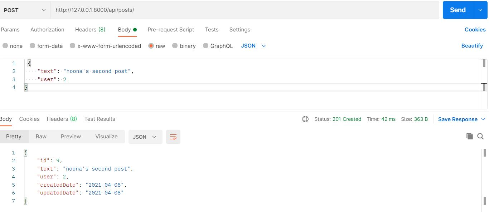
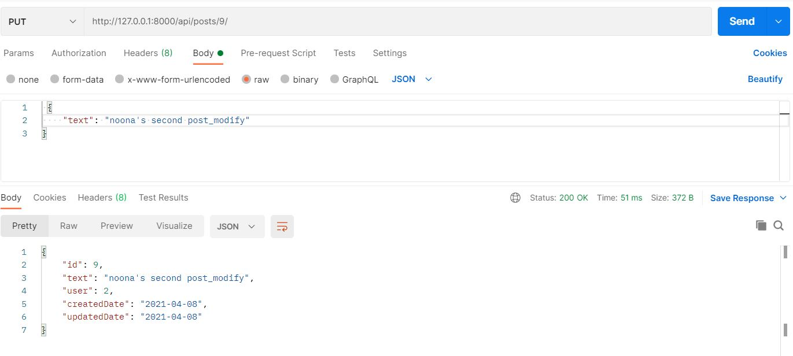
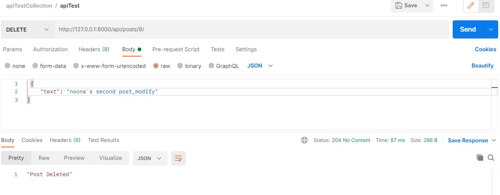

# CEOS 13기 백엔드 스터디
## REST API 서버 개발
### 인스타그램 클론

## 3주차 과제

###모델 선택 및 데이터 삽입
``` mysql
# User Table Description
+--------------+--------------+------+-----+---------+----------------+
| Field        | Type         | Null | Key | Default | Extra          |
+--------------+--------------+------+-----+---------+----------------+
| id           | int          | NO   | PRI | NULL    | auto_increment |
| last_login   | datetime(6)  | YES  |     | NULL    |                |
| is_superuser | tinyint(1)   | NO   |     | NULL    |                |
| username     | varchar(100) | NO   | UNI | NULL    |                |
| password     | varchar(50)  | NO   |     | NULL    |                |
| phone        | varchar(32)  | YES  |     | NULL    |                |
| email        | varchar(254) | YES  | UNI | NULL    |                |
+--------------+--------------+------+-----+---------+----------------+


# Post Table Description
+-------------+----------+------+-----+---------+----------------+
| Field       | Type     | Null | Key | Default | Extra          |
+-------------+----------+------+-----+---------+----------------+
| id          | int      | NO   | PRI | NULL    | auto_increment |
| text        | longtext | YES  |     | NULL    |                |
| createdDate | date     | NO   |     | NULL    |                |
| updatedDate | date     | YES  |     | NULL    |                |
| user_id     | int      | NO   | MUL | NULL    |                |
+-------------+----------+------+-----+---------+----------------+

```
3개의 유저 생성, 1개의 포스트 삽입

```python shell
>>> from api.models import CustomUser, Post
>>> User.objects.all()
<QuerySet [<CustomUser: jjigae>, <CustomUser: noonna>, <CustomUser: servant>]>
>>> Post.objects.all()
<QuerySet [<Post: jjigae's first post>]>
```


###모든 list를 가져오는 API
최상위 urls.py
```djangotemplate
urlpatterns = [
    path('admin/', admin.site.urls),
    path('api/', include('api.urls')),
]

```
api/urls.py
```djangotemplate
urlpatterns = [
    path('posts/', views.postsList),
    path('profiles/', views.profilesList),
    path('users/', views.usersList),
]
```
http://127.0.0.1:8000/api/users/  
요청 시
```json
[
    {
        "id": 1,
        "username": "jjigae",
        "posts": [
            {
                "text": "jjigae's first post",
                "user_id": 1
            }
        ]
    },
    {
        "id": 2,
        "username": "noonna",
        "posts": []
    },
    {
        "id": 3,
        "username": "servant",
        "posts": []
    }
]
```

###새로운 데이터를 create하도록 요청하는 API
http://127.0.0.1:8000/api/users/ 로 post 요청
```json
{
    "username": "user4"
}
```
결과
```json

{
    "id": 4,
    "username": "user4",
    "posts": []
}
```


###새로 알게된 점
https://gaussian37.github.io/python-rest-nested-serializer/
serializers.py에서 nested serialize를 구현할 때 'related name'이 중요합니다!!
#### related name을 사용했을 경우
```python
class UserSerializer(serializers.ModelSerializer):
    posts = PostSerializer(many=True, read_only=True)  # use related name

    class Meta:
        model = User  # 사용할 모델
        fields = ['username', 'password', 'email', 'posts', 'Profile_set']

```
nest하고자 하는 serializer의 변수명을 related name으로 써주고, fields에 추가합니다.

####related name을 사용하지 않을 경우
따로 PostSerializer을 할당받지 않고 fileds에 'post_set' 을 추가하여 사용가능합니다.  
(그런데 저는 field name ~ is not valid for model ~ 에러났습니다ಠ_ಠ)

###간단한 회고
포스트 모델에 post할때 fk에 해당하는 user_id가 json으로 렌더링 될 때 null이 되어버리는 문제..!  
<Integrity Error : column 'user_id' cannot be null>
Field 안에 user_id 컬럼을 넣어줬는데도 post 하면 user_id에 넣어준 값을 읽지 않고 비어있다고 합니다ㅠㅠ  
해결방법! : create 메서드를 오버라이드 해서 user_id 칼럼에 직접 집어넣는 과정을 넣어줬습니다.  
```python
class PostSerializer(serializers.ModelSerializer):
    class Meta:
        model = Post  # 사용할 모델
        fields = ['text', 'user']

    def create(self, validated_data):
        user_data = validated_data.pop('user')
        post = Post.objects.create(user=user_data, **validated_data)
        post.user_id = user_data
        return post
```
결과 


##4주차 과제 

```djangotemplate
#urls.py
urlpatterns = [
    path('posts/', views.PostListAll.as_view()),
    path('posts/<int:pk>/', views.PostList.as_view()),
    path('users/', views.UserListAll.as_view()),
    path('users/<int:pk>/', views.UserList.as_view()),
]
```
###모든 list를 가져오는 API
- http://127.0.0.1:8000/api/users/ GET 요청 시, json 결과
```json
[
    {
        "username": "jjigae",
        "password": "1234",
        "email": "jjigae@ex.com",
        "posts": [
            {
                "id": 6,
                "text": "jiggae's first post",
                "user": 1,
                "createdDate": "2021-04-08",
                "updatedDate": "2021-04-08"
            },
            {
                "id": 8,
                "text": "jjigae's second post",
                "user": 1,
                "createdDate": "2021-04-08",
                "updatedDate": "2021-04-08"
            }
        ]
    },
    {
        "username": "noonna",
        "password": "1234",
        "email": "noonna@ex.com",
        "posts": [
            {
                "id": 7,
                "text": "noonna's first post",
                "user": 2,
                "createdDate": "2021-04-08",
                "updatedDate": "2021-04-08"
            }
        ]
    }
]
```


###특정 데이터를 가져오는 API
- http://127.0.0.1:8000/api/users/1/ GET 요청 시, json 결과
```json
{
    "username": "jjigae",
    "password": "1234",
    "email": "jjigae@ex.com",
    "posts": [
        {
            "id": 6,
            "text": "jiggae's first post",
            "user": 1,
            "createdDate": "2021-04-08",
            "updatedDate": "2021-04-08"
        },
        {
            "id": 8,
            "text": "jjigae's second post",
            "user": 1,
            "createdDate": "2021-04-08",
            "updatedDate": "2021-04-08"
        }
    ]
}
```

###새로운 데이터를 생성하는 API


http://127.0.0.1:8000/api/posts/ GET 결과 (id 9 post 생성)
```json

[
    {
        "id": 6,
        "text": "jiggae's first post",
        "user": 1,
        "createdDate": "2021-04-08",
        "updatedDate": "2021-04-08"
    },
    {
        "id": 7,
        "text": "noonna's first post",
        "user": 2,
        "createdDate": "2021-04-08",
        "updatedDate": "2021-04-08"
    },
    {
        "id": 8,
        "text": "jjigae's second post",
        "user": 1,
        "createdDate": "2021-04-08",
        "updatedDate": "2021-04-08"
    },
    {
        "id": 9,
        "text": "noona's second post",
        "user": 2,
        "createdDate": "2021-04-08",
        "updatedDate": "2021-04-08"
    }
]
```
###특정 데이터를 업데이트하는 API

```json
{
    "id": 9,
    "text": "noona's second post_modify",
    "user": 2,
    "createdDate": "2021-04-08",
    "updatedDate": "2021-04-08"
}
```

###특정 데이터를 삭제하는 API


id=9 post DELETE 후 http://127.0.0.1:8000/api/posts/9/ 요청 시, json 결과
```json
"post does not exist"
```

##공부한 내용 정리
get(특정 데이터만), put, delete 시에 하나의 데이터만 다루기 때문에 serializer를 instance화 할 때 many=True는 사용하면 안됨
ex) serializer = PostSerializer(post)

##간단한 회고
리뷰해주시는 분 시험 화이티잉ㅇ~~ 과제도 화이티이잉~~


#6주차 과제

## viewset 으로 리팩토링하기

view.py
```python
class ProfileViewSet(viewsets.ModelViewSet):
    serializer_class = ProfileSerializer
    queryset = Profile.objects.all()
    filter_backends = [DjangoFilterBackend]
    filterset_class = ProfileFilter


class PostViewSet(viewsets.ModelViewSet):
    serializer_class = PostSerializer
    queryset = Post.objects.all()
    filter_backends = [DjangoFilterBackend]
    filterset_class = PostFilter


class UserViewSet(viewsets.ModelViewSet):
    serializer_class = UserSerializer
    queryset = User.objects.all()
    filter_backends = [DjangoFilterBackend]
    filterset_class = UserFilter
```
filters.py
```python
class PostFilter(FilterSet):
    user = NumberFilter(field_name='user')

    class Meta:
        model = Post
        fields = ['user']


class ProfileFilter(FilterSet):
    gender = CharFilter(field_name='gender')
    bio_is_empty = BooleanFilter(field_name='bio', method='filter_bio_is_null')

    class Meta:
        model = Profile
        fields = ['gender']

    def filter_bio_is_null(self,queryset,bio,value):
        filtered_set_true = queryset.filter(bio__isnull = True )
        filtered_set_false = queryset.filter(bio__isnull = False)
        if value:
            return filtered_set_true
        else:
            return filtered_set_false


class UserFilter(FilterSet):
    username = CharFilter(field_name='username')

    class Meta:
        model=User
        fields = ['username']
```
postman 결과 

http://127.0.0.1:8000/api/user/   [GET]

```json
[
    {
        "username": "jjigae",
        "password": "1234",
        "email": "jjigae@ex.com",
        "posts": [
            {
                "id": 6,
                "text": "jjigae's first post modify",
                "user": 1,
                "createdDate": "2021-04-08",
                "updatedDate": "2021-05-13"
            },
            {
                "id": 8,
                "text": "jjigae's second post",
                "user": 1,
                "createdDate": "2021-04-08",
                "updatedDate": "2021-04-08"
            }
        ],
        "profiles": {
            "id": 1,
            "bio": "Hi im corgi",
            "website": "",
            "profile_name": "",
            "gender": "",
            "birth": null,
            "photo": null,
            "user": 1
        }
    },
    {
        "username": "noonna",
        "password": "1234",
        "email": "noonna@ex.com",
        "posts": [
            {
                "id": 7,
                "text": "noonna's first post",
                "user": 2,
                "createdDate": "2021-04-08",
                "updatedDate": "2021-04-08"
            }
        ],
        "profiles": {
            "id": 2,
            "bio": "Hi im jjigae noonna",
            "website": "",
            "profile_name": "jenn kim",
            "gender": "female",
            "birth": null,
            "photo": null,
            "user": 2
        }
    }
]
```
## filter기능 구현하기

postman 결과

http://127.0.0.1:8000/api/profile/?gender=female   [GET]
```json
[
    {
        "id": 2,
        "bio": "Hi im jjigae noonna",
        "website": "",
        "profile_name": "jenn kim",
        "gender": "female",
        "birth": null,
        "photo": null,
        "user": 2
    }
]
```
http://127.0.0.1:8000/api/profile/?gender=female&bio_is_empty=true   [GET]
```json
[]
```
### 공부한 내용 정리

### 간단한 회고
viewset 정말 최고.. 만만세다. modelviewset 외에도 다양한 viewset의 종류와 쓰임에 대해 더 공부해봐야겠다.  
쿼리문을 다루는 것이 백엔드에서 굉장히 중요하다고 매번 느끼는데 매번 기억이 안나서 구글링하는 것이 슬프다.껄껄