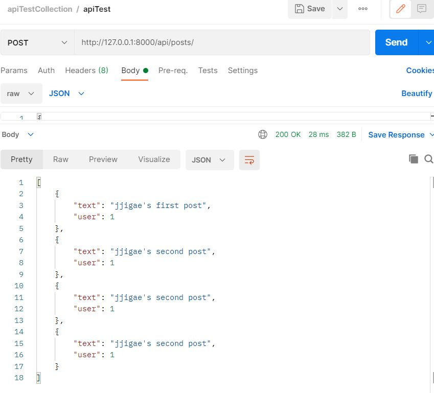

# CEOS 13기 백엔드 스터디
## REST API 서버 개발
### 인스타그램 클론

## 3주차 과제

###모델 선택 및 데이터 삽입
``` mysql
# User Table Description
+--------------+--------------+------+-----+---------+----------------+
| Field        | Type         | Null | Key | Default | Extra          |
+--------------+--------------+------+-----+---------+----------------+
| id           | int          | NO   | PRI | NULL    | auto_increment |
| last_login   | datetime(6)  | YES  |     | NULL    |                |
| is_superuser | tinyint(1)   | NO   |     | NULL    |                |
| username     | varchar(100) | NO   | UNI | NULL    |                |
| password     | varchar(50)  | NO   |     | NULL    |                |
| phone        | varchar(32)  | YES  |     | NULL    |                |
| email        | varchar(254) | YES  | UNI | NULL    |                |
+--------------+--------------+------+-----+---------+----------------+


# Post Table Description
+-------------+----------+------+-----+---------+----------------+
| Field       | Type     | Null | Key | Default | Extra          |
+-------------+----------+------+-----+---------+----------------+
| id          | int      | NO   | PRI | NULL    | auto_increment |
| text        | longtext | YES  |     | NULL    |                |
| createdDate | date     | NO   |     | NULL    |                |
| updatedDate | date     | YES  |     | NULL    |                |
| user_id     | int      | NO   | MUL | NULL    |                |
+-------------+----------+------+-----+---------+----------------+

```
3개의 유저 생성, 1개의 포스트 삽입

```python shell
>>> from api.models import CustomUser, Post
>>> User.objects.all()
<QuerySet [<CustomUser: jjigae>, <CustomUser: noonna>, <CustomUser: servant>]>
>>> Post.objects.all()
<QuerySet [<Post: jjigae's first post>]>
```


###모든 list를 가져오는 API
최상위 urls.py
```djangotemplate
urlpatterns = [
    path('admin/', admin.site.urls),
    path('api/', include('api.urls')),
]

```
api/urls.py
```djangotemplate
urlpatterns = [
    path('posts/', views.postsList),
    path('profiles/', views.profilesList),
    path('users/', views.usersList),
]
```
http://127.0.0.1:8000/api/users/  
요청 시
```json
[
    {
        "id": 1,
        "username": "jjigae",
        "posts": [
            {
                "text": "jjigae's first post",
                "user_id": 1
            }
        ]
    },
    {
        "id": 2,
        "username": "noonna",
        "posts": []
    },
    {
        "id": 3,
        "username": "servant",
        "posts": []
    }
]
```

###새로운 데이터를 create하도록 요청하는 API
http://127.0.0.1:8000/api/users/ 로 post 요청
```json
{
    "username": "user4"
}
```
결과
```json

{
    "id": 4,
    "username": "user4",
    "posts": []
}
```


###새로 알게된 점
https://gaussian37.github.io/python-rest-nested-serializer/
serializers.py에서 nested serialize를 구현할 때 'related name'이 중요합니다!!
#### related name을 사용했을 경우
```python
class UserSerializer(serializers.ModelSerializer):
    posts = PostSerializer(many=True, read_only=True)  # use related name

    class Meta:
        model = User  # 사용할 모델
        fields = ['username', 'password', 'email', 'posts', 'Profile_set']

```
nest하고자 하는 serializer의 변수명을 related name으로 써주고, fields에 추가합니다.

####related name을 사용하지 않을 경우
따로 PostSerializer을 할당받지 않고 fileds에 'post_set' 을 추가하여 사용가능합니다.  
(그런데 저는 field name ~ is not valid for model ~ 에러났습니다ಠ_ಠ)

###간단한 회고
포스트 모델에 post할때 fk에 해당하는 user_id가 json으로 렌더링 될 때 null이 되어버리는 문제..!  
<Integrity Error : column 'user_id' cannot be null>
Field 안에 user_id 컬럼을 넣어줬는데도 post 하면 user_id에 넣어준 값을 읽지 않고 비어있다고 합니다ㅠㅠ  
해결방법! : create 메서드를 오버라이드 해서 user_id 칼럼에 직접 집어넣는 과정을 넣어줬습니다.  
```python
class PostSerializer(serializers.ModelSerializer):
    class Meta:
        model = Post  # 사용할 모델
        fields = ['text', 'user']

    def create(self, validated_data):
        user_data = validated_data.pop('user')
        post = Post.objects.create(user=user_data, **validated_data)
        post.user_id = user_data
        return post
```
결과 


